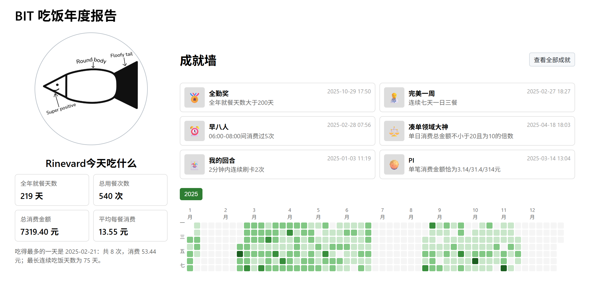

# BIT-Annual-Eat

一年过去了，你在百丽食堂里花的钱都花在哪儿了？

## 项目简介

本项目是一个用于统计百丽宫大学学生校园卡消费情况的脚本。它获取学生的校园卡消费记录并可视化。

本项目受[PKU-Annual-Eat](https://github.com/KingRayCao/PKU-Annual-Eat)启发，感谢原作者的贡献。

## 使用方法

下载[蓝奏云里的文件(2025-11-24)]()，或者下载[ release 里的文件(2025-11-24)]()，然后先解压再运行。也可以选择 `pip install -r requirements.txt` 然后 `python main.py` 来从源码运行。

生成的网页、图片和表格会保存在 `output` 文件夹中。

强烈建议同学们修改校园卡密码以保护个人隐私和安全。校园卡的初始密码是 123456 或 000000，如果你从未修改过密码，请尽快修改为只有你自己知道的密码。据我所知目前（2025年11月）校园卡密码仅支持线下修改，良乡的同学们可以去学生服务中心修改。

## 其他或许有用的文章

[security.md](./docs/security.md) 里记载了安全性，如果担心校园卡号和密码的泄露可以读一读。
[dev.md](./docs/dev.md) 里记载了项目概述，如果对源码有兴趣可以读一读。

## TODO

1. 头像、用户名、成就持久化保存，而不是新上传一次 html 就没了
2. 成就墙没拿到的成就除了勾选框变暗，文字和图片也要变暗，变暗程度和左边的勾选框变暗程度一致
3. 隐藏成就做特殊边框
4. 前端编辑模式和隐藏入口——我们需要随机生成pw，而不是检测到 "pw=" 这个字符串就允许编辑
5. 凑成就到 20/25 个普通成就
6. 把分享链接记录在output的某个文本文件里
7. 可选：强调年度报告性，输入年份而不是日期

## LICENSE

本仓库的内容采用 [Creative Commons Zero](https://creativecommons.org/publicdomain/zero/1.0/) 许可协议。您可以复制、修改、分发、表演该作品，用于商业目的，不需要征得许可，也不需要署名。

本项目仅供个人学习与对本人校园卡账户数据的分析使用。请勿使用本项目尝试登录或查询他人账号，请勿使用本项目用于批量抓取、撞库或任何可能违反学校规定及法律法规的行为。使用本项目产生的任何后果由使用者本人承担，本项目作者不对使用者行为负责。