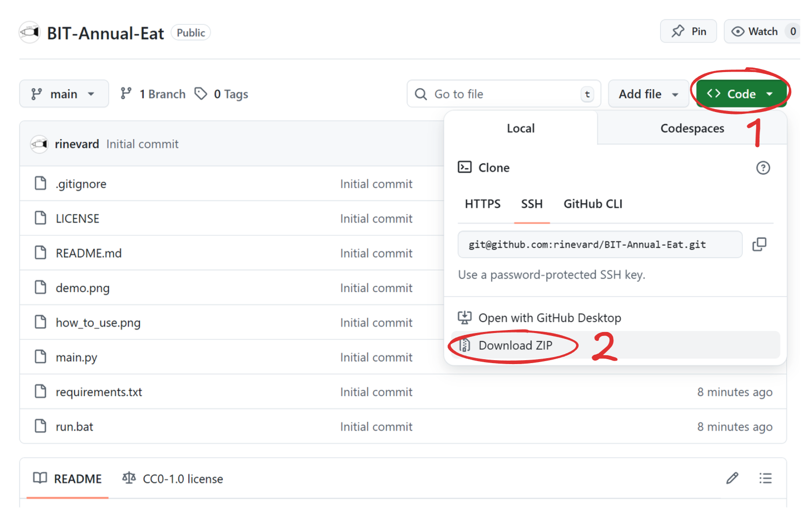

# BIT-Annual-Eat

一年过去了，你在百丽食堂里花的钱都花在哪儿了？

## 项目简介

本项目是一个用于统计百丽宫大学学生校园卡消费情况的脚本。它获取学生的校园卡消费记录并可视化。

本项目受[PKU-Annual-Eat](https://github.com/KingRayCao/PKU-Annual-Eat)的启发，感谢原作者的贡献。

## 使用方法

首先下载本代码库的文件并解压，下载方法如下图所示：

然后有两种可选方法生成结果：

1. 方法一：运行一键脚本

    1. 安装 python
    2. 双击运行 `run.bat` 脚本
    3. 按提示输入学号和校园卡密码
    4. 生成的图片和表格会保存在 `output` 文件夹中

    

2. 方法二：手动安装依赖

    1. 安装 python
    2. 安装依赖：`pip install -r requirements.txt`
    3. 运行脚本：`python main.py`
    4. 按提示输入学号和校园卡密码
    5. 生成的图片和表格会保存在 `output` 文件夹中

## LICENSE

本仓库的内容采用 [Creative Commons Zero](https://creativecommons.org/publicdomain/zero/1.0/) 许可协议。您可以复制、修改、分发、表演该作品，用于商业目的，不需要征得许可，也不需要署名。